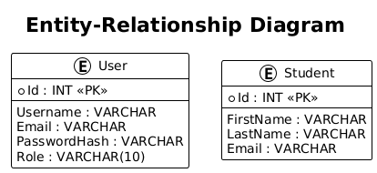
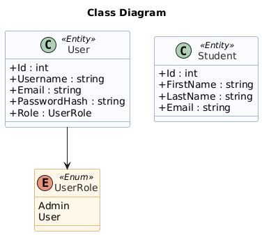
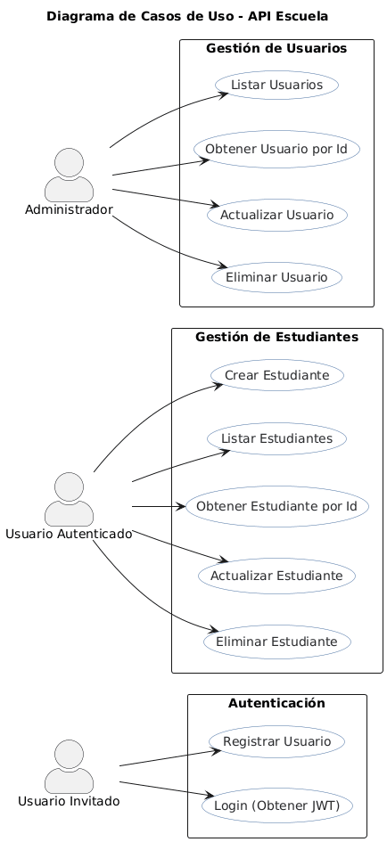
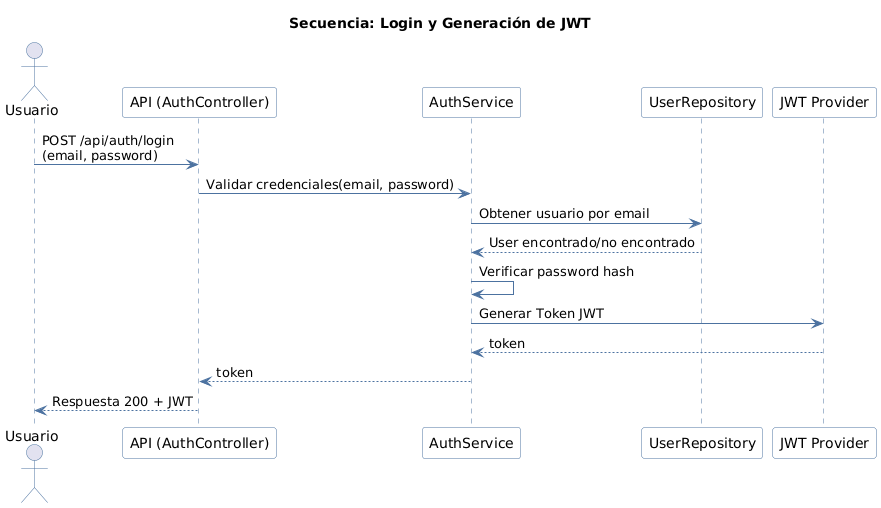

# webEscuela - API REST en .NET

## Índice

- [webEscuela - API REST en .NET](#webescuela---api-rest-en-net)
  - [Índice](#índice)
  - [Objetivo General](#objetivo-general)
  - [Alcance](#alcance)
    - [Usuarios](#usuarios)
    - [Estudiantes](#estudiantes)
  - [Entregables por equipo](#entregables-por-equipo)
  - [Estructura de Proyectos Recomendada (DDD / Capas)](#estructura-de-proyectos-recomendada-ddd--capas)
    - [webEscuela.Api](#webescuelaapi)
    - [webEscuela.Application](#webescuelaapplication)
    - [webEscuela.Domain](#webescueladomain)
    - [webEscuela.Infrastructure](#webescuelainfrastructure)
  - [Tecnologías](#tecnologías)
  - [Modelado de Datos](#modelado-de-datos)
    - [Diagrama Entidad-Relación (ER)](#diagrama-entidad-relación-er)
    - [Diagrama de Clases](#diagrama-de-clases)
  - [Casos de Uso](#casos-de-uso)
  - [Secuencias](#secuencias)
    - [Generación de Token JWT](#generación-de-token-jwt)
  - [Instalación y Configuración](#instalación-y-configuración)

---

## Objetivo General

Desarrollar una API REST en .NET con arquitectura en capas (API, Application, Domain, Infrastructure) que implemente:

- CRUD de Usuarios (con roles básicos).
- CRUD de Estudiantes.
- Autenticación JWT (registro y login).
- Documentación con Swagger.
- Dockerización (API + MySQL).

Los equipos entregarán código, migraciones, docker-compose funcional y una colección Postman.

---

## Alcance

Funcionalidad mínima exigida:

### Usuarios

- `POST /api/auth/register` — registrar usuario (username, email, password, role).
- `POST /api/auth/login` — login -> devuelve JWT.
- `GET /api/users` — listar (protegido, rol Admin).
- `GET /api/users/{id}` — obtener por id (protegido).
- `PUT /api/users/{id}` — actualizar (protegido).
- `DELETE /api/users/{id}` — eliminar (protegido).

### Estudiantes

- `POST /api/students` — crear (protegido).
- `GET /api/students` — listar (protegido).
- `GET /api/students/{id}` — obtener por id (protegido).
- `PUT /api/students/{id}` — actualizar (protegido).
- `DELETE /api/students/{id}` — eliminar (protegido).

**Protección:** todas las rutas excepto register y login requieren JWT válido. Algunas rutas (p. ej., usuarios list/delete) restringidas a rol Admin.

---

## Entregables por equipo

1. Repositorio GitHub con solución en C# (4 proyectos).
2. `docker-compose.yml` funcional (API + MySQL + Adminer opcional).
3. Migraciones EF Core en el repo y DbContext configurado.
4. Collection Postman exportada.
5. Al menos 2 pruebas unitarias en la capa Application (ej.: validación de creación de estudiante, verificación de login).

---

## Estructura de Proyectos Recomendada (DDD / Capas)

### webEscuela.Api

- Controladores, middleware, inyección de dependencias (`Program.cs`).
- Orquesta llamadas hacia Application.

### webEscuela.Application

- Servicios (use-cases), DTOs, interfaces de servicios y casos de negocio.
- Pruebas unitarias que validen lógica de negocio.
- Ejemplos: `IUserService`, `IStudentService`, `UserService`, `StudentService`.

### webEscuela.Domain

- Entidades puras y reglas de dominio (POCOs).
- Repositorios interfaces del dominio (`IUserRepository`, `IStudentRepository`).
- Value objects, exceptions de dominio.

### webEscuela.Infrastructure

- Implementaciones concretas: `EfDbContext`, `UserRepository : IUserRepository`.
- Mapeos EF Core, migraciones, seed data.
- Persistencia y acceso a MySQL.

**Flujo:** Controller (API) → Service (Application) → Repository (Infrastructure) → Db (MySQL).

---

## Tecnologías

- C# / .NET 7+
- Entity Framework Core
- MySQL
- Docker + Docker Compose
- JWT (Json Web Token)
- Swagger (documentación API)

---

## Modelado de Datos

### Diagrama Entidad-Relación (ER)

### Diagrama de Clases

---

## Casos de Uso

---

## Secuencias

### Generación de Token JWT

---

## Instalación y Configuración

Pendiente de completar.
